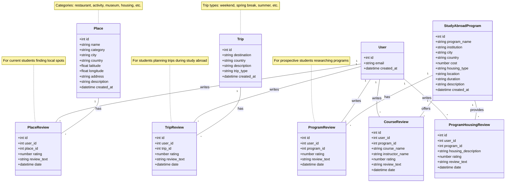

# Abroadly - Data Model UML

## Model Separation Strategy

### 📚 Program Ecosystem (Prospective Students)
Used when researching which program to choose:
- **StudyAbroadProgram**: Core program info
- **ProgramReview**: Overall program experience
- **CourseReview**: Academic quality feedback
- **ProgramHousingReview**: Dorm/program-provided housing

### 🗺️ Place Ecosystem (Current Students)
Used when abroad and exploring the city:
- **Place**: Restaurants, activities, museums, independent housing (category-based)
- **PlaceReview**: Reviews of any place (including independent housing)

### ✈️ Trip Ecosystem (Trip Planning)
Used for planning weekend trips, spring break, etc. (independent of program/location):
- **Trip**: Suggested destinations/trips for college students
- **TripReview**: Reviews of trips/destinations

## Key Design Decisions

1. ✅ **Three separate ecosystems** 
   - Program reviews (prospective students researching programs)
   - Place reviews (current students exploring their city)
   - Trip reviews (students planning getaways/trips)
2. ✅ **Housing split** - Program housing (ProgramHousingReview tied to program) vs Independent housing (Place with category="housing")
3. ✅ **Course reviews** - Tied to programs for academic evaluation
4. ✅ **All reviews** - Linked to users for accountability
5. ✅ **Geolocation** - Latitude/longitude for map integration on Places
6. ✅ **Category-based places** - Single Place model with category field (restaurant, activity, housing, etc.) - flexible and simple
7. ✅ **Minimal trip model** - Start simple with destination and reviews, expand later as needed

## To View This Diagram

1. **GitHub/GitLab**: Automatically renders Mermaid
2. **VS Code**: Install "Markdown Preview Mermaid Support" extension
3. **Online**: Copy to [mermaid.live](https://mermaid.live)
4. **Notion/Obsidian**: Native Mermaid support
